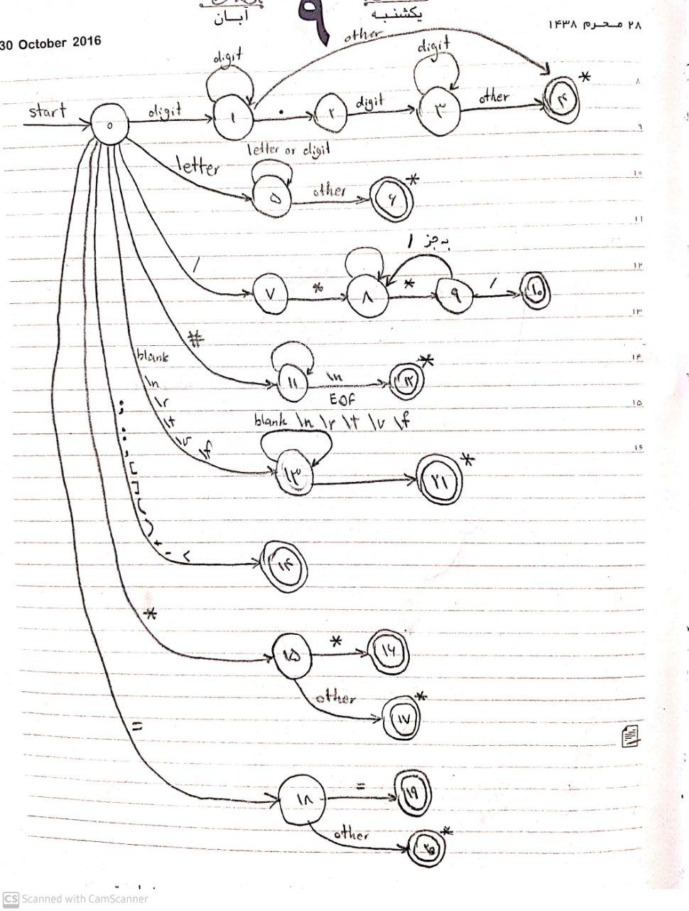

# Compiler
Compiler Project - Spring Semester 2022

## teammates
    Masih Beigi - 98101244
    Ali Moroukian - 98106094

## DFA

## Parse Table

NT \ T                  |   ;       |   break                   | continue                  |   ID                          |   =   |   [                           |   ]           |   (                       |   )           |   ,                               |   return                  |   global                  |   def                             |   :           |   if                                                  |   else                |   while                                   |   ==          |   <           |   +                       |   -                       |   *                   |   **          |   NUM                         |   $
:---:                   | :---:     | :---:                     | :---:                     | :---:                         | :---: | :---:                         | :---:         | :---:                     | :---:         | :---:                             | :---:                     | :---:                     | :---:                             | :---:         | :---:                                                 | :---:                 | :---:                                     | :---:         | :---:         | :---:                     | :---:                     | :---:                 | :---:         | :---:                         | :---:
Program                 |           |   Statements              |   Statements              |   Statements                  |       |                               |               |                           |               |                                   |   Statements              |   Statements              |   Statements                      |               |   Statements                                          |                       |   Statements                              |               |               |                           |                           |                       |               |                               |   Statements
Statements              | &epsilon; |   Statement ; Statements	|   Statement ; Statements  |   Statement ; Statements      |       |                               |               |                           |               |                                   |   Statement ; Statements  |   Statement ; Statements  |   Statement ; Statements          |               |   Statement ; Statements                              |   &epsilon;           |   Statement ; Statements                  |               |               |                           |                           |                       |               |                               |   &epsilon;
Statement               |   sync    |   Simple_stmt             |   Simple_stmt             |   Simple_stmt                 |       |                               |               |                           |               |                                   |   Simple_stmt             |   Simple_stmt             |   Compound_stmt                   |               |   Compound_stmt                                       |                       |   Compound_stmt                           |               |               |                           |                           |                       |               |                               |
Simple_stmt             |   sync    |   break                   |   continue                |   Assignment_Call             |       |                               |               |                           |               |                                   |   Return_stmt             |   Global_stmt             |                                   |               |                                                       |                       |                                           |               |               |                           |                           |                       |               |                               |
Compound_stmt           |   sync    |                           |                           |                               |       |                               |               |                           |               |                                   |                           |                           |   Function_def                    |               |   If_stmt                                             |                       |   Iteration_stmt                          |               |               |                           |                           |                       |               |                               |
Assignment_Call         |   sync    |                           |                           |   ID B                        |       |                               |               |                           |               |                                   |                           |                           |                                   |               |                                                       |                       |                                           |               |               |                           |                           |                       |               |                               |
B                       |   sync    |                           |                           |                               |   = C	|   [ Expression ] = C          |               |   ( Arguments )           |               |                                   |                           |                           |                                   |               |                                                       |                       |                                           |               |               |                           |                           |                       |               |                               |
C                       |   sync    |                           |                           |   Expression                  |       |   [ Expression List_Rest ]    |               |                           |               |                                   |                           |                           |                                   |               |                                                       |                       |                                           |               |               |                           |                           |                       |               |   Expression                  |
List_Rest               |           |                           |                           |                               |       |                               |   &epsilon;   |                           |               |   , Expression List_Rest          |                           |                           |                                   |               |                                                       |                       |                                           |               |               |                           |                           |                       |               |                               |
Return_stmt             |   sync    |                           |                           |                               |       |                               |               |                           |               |                                   |   return Return_Value     |                           |                                   |               |                                                       |                       |                                           |               |               |                           |                           |                       |               |                               |
Return_Value            | &epsilon; |                           |                           |   Expression                  |       |                               |               |                           |               |                                   |                           |                           |                                   |               |                                                       |                       |                                           |               |               |                           |                           |                       |               |   Expression                  |
Global_stmt             |   sync    |                           |                           |                               |       |                               |               |                           |               |                                   |                           |   global ID               |                                   |               |                                                       |                       |                                           |               |               |                           |                           |                       |               |                               |
Function_def            |   sync    |                           |                           |                               |       |                               |               |                           |               |                                   |                           |                           |   def ID ( Params ) : Statements  |               |                                                       |                       |                                           |               |               |                           |                           |                       |               |                               |
Params                  |           |                           |                           |   ID Params_Prime             |       |                               |               |                           |   &epsilon;   |                                   |                           |                           |                                   |               |                                                       |                       |                                           |               |               |                           |                           |                       |               |                               |
Params_Prime            |           |                           |                           |                               |       |                               |               |                           |   &epsilon;   |   , ID Params_Prime               |                           |                           |                                   |               |                                                       |                       |                                           |               |               |                           |                           |                       |               |                               |
If_stmt                 |   sync    |                           |                           |                               |       |                               |               |                           |               |                                   |                           |                           |                                   |               |   if Relational_Expression : Statements Else_block    |                       |                                           |               |               |                           |                           |                       |               |                               |
Else_block              | &epsilon; |                           |                           |                               |       |                               |               |                           |               |                                   |                           |                           |                                   |               |                                                       |   else : Statements   |                                           |               |               |                           |                           |                       |               |                               |
Iteration_stmt          |   sync    |                           |                           |                               |       |                               |               |                           |               |                                   |                           |                           |                                   |               |                                                       |                       |while ( Relational_Expression ) Statements |               |               |                           |                           |                       |               |                               |
Relational_Expression   |           |                           |                           |   Expression Relop Expression |       |                               |               |                           |   sync        |                                   |                           |                           |                                   |   sync        |                                                       |                       |                                           |               |               |                           |                           |                       |               |   Expression Relop Expression |
Relop                   |           |                           |                           |   sync                        |       |                               |               |                           |               |                                   |                           |                           |                                   |               |                                                       |                       |                                           |   ==          |   <           |                           |                           |                       |               |   sync                        |
Expression              |   sync    |                           |                           |   Term Expression_Prime       |       |                               |   sync        |                           |   sync        |   sync                            |                           |                           |                                   |   sync        |                                                       |                       |                                           |   sync        |   sync        |                           |                           |                       |               |   Term Expression_Prime       |
Expression_Prime        | &epsilon; |                           |                           |                               |       |                               |   &epsilon;   |                           |   &epsilon;   |   &epsilon;                       |                           |                           |                                   |   &epsilon;   |                                                       |                       |                                           |   &epsilon;   |   &epsilon;   |   + Term Expression_Prime |   - Term Expression_Prime |                       |               |                               |
Term                    |   sync    |                           |                           |   Factor Term_Prime           |       |                               |   sync        |                           |   sync        |   sync                            |                           |                           |                                   |   sync        |                                                       |                       |                                           |   sync        |   sync        |   sync                    |   sync                    |                       |               |   Factor Term_Prime           |
Term_Prime              | &epsilon; |                           |                           |                               |       |                               |   &epsilon;   |                           |   &epsilon;   |   &epsilon;                       |                           |                           |                                   |   &epsilon;   |                                                       |                       |                                           |   &epsilon;   |   &epsilon;   |   &epsilon;               |   &epsilon;               |   * Factor Term_Prime |               |                               |
Factor                  |   sync    |                           |                           |   Atom Power                  |       |                               |   sync        |                           |   sync        |   sync                            |                           |                           |                                   |   sync        |                                                       |                       |                                           |   sync        |   sync        |   sync                    |   sync                    |   sync                |               |   Atom Power                  |
Power                   |   Primary |                           |                           |                               |       |                               |   Primary     |   Primary                 |   Primary     |   Primary                         |                           |                           |                                   |   Primary     |                                                       |                       |                                           |   Primary     |   Primary     |   Primary                 |   Primary                 |   Primary             |   ** Factor   |                               |
Primary                 | &epsilon; |                           |                           |                               |       |                               |   &epsilon;   |   ( Arguments ) Primary   |   &epsilon;   |   &epsilon;                       |                           |                           |                                   |   &epsilon;   |                                                       |                       |                                           |   &epsilon;   |   &epsilon;   |   &epsilon;               |   &epsilon;               |   &epsilon;           |               |                               |
Arguments               |           |                           |                           |   Expression Arguments_Prime  |       |                               |               |                           |   &epsilon;   |                                   |                           |                           |                                   |               |                                                       |                       |                                           |               |               |                           |                           |                       |               |   Expression Arguments_Prime  |
Arguments_Prime         |           |                           |                           |                               |       |                               |               |                           |   &epsilon;   |   , Expression Arguments_Prime    |                           |                           |                                   |               |                                                       |                       |                                           |               |               |                           |                           |                       |               |                               |
Atom                    |   sync    |                           |                           |   ID                          |       |   sync                        |   sync        |   sync                    |   sync        |   sync                            |                           |                           |                                   |   sync        |                                                       |                       |                                           |   sync        |   sync        |   sync                    |   sync                    |   sync                |   sync        |   NUM                         |
